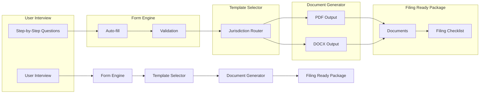

# 📂 Court Document Automation Engine

**TurboTax for legal filings.**

[](LICENSE)

[](CONTRIBUTING.md)
[](https://github.com/dougdevitre/court-doc-engine/pulls)

---

## The Problem

Filing court documents is confusing, expensive, and error-prone. Self-represented litigants face dozens of jurisdiction-specific forms, each with different requirements, formatting rules, and filing procedures. One mistake can mean a rejected filing, a missed deadline, or a lost case.

Attorneys spend hours on document preparation that could be automated. Court clerks spend hours rejecting improperly formatted filings that could have been caught earlier.

## The Solution

A guided, step-by-step document automation engine. Think TurboTax, but for legal filings. Answer simple questions in plain language. The engine selects the right forms for your jurisdiction, auto-fills from case data, validates for completeness, and generates filing-ready PDF and DOCX documents.

No legal expertise required to use it. No expensive software required to run it.

---

## Architecture



---

## Who This Helps

| Audience | How This Helps |
|---|---|
| **Self-represented litigants** | File court documents without an attorney |
| **Legal aid attorneys** | Automate repetitive document preparation |
| **Court clerks** | Receive properly formatted, complete filings |
| **Paralegal staff** | Accelerate document workflows |

---

## Features

- [ ] Guided interview workflows — plain-language questions, step by step
- [ ] Smart auto-fill from case data and prior filings
- [ ] 50-state jurisdiction template library
- [ ] PDF and DOCX generation with court-compliant formatting
- [ ] Filing checklist generator — what to file, where, and when
- [ ] Form validation with clear error messages
- [ ] Save and resume incomplete interviews
- [ ] Template contribution system for community-maintained forms

---

## Tech Stack

| Layer | Technology |
|---|---|
| Language | TypeScript |
| Runtime | Node.js |
| PDF | pdf-lib / Puppeteer |
| DOCX | docx.js |
| Testing | Vitest |
| Linting | ESLint + Prettier |

---

## Quick Start

```bash
git clone https://github.com/dougdevitre/court-doc-engine.git
cd court-doc-engine
npm install
npm run dev
```

### Generate a Court Document Programmatically

```typescript
import { InterviewEngine } from './src/interview/engine';

const engine = new InterviewEngine();

// Start a guided interview for a Missouri eviction petition
const session = await engine.startInterview('eviction-petition', { jurisdiction: 'MO' });

// Answer questions step by step
await session.answer('plaintiff_name', 'Jane Smith');
await session.answer('defendant_name', 'John Doe');
await session.answer('property_address', '123 Main St, Springfield, MO 65801');
await session.answer('grounds', 'nonpayment');
await session.answer('amount_owed', 2400);

// Generate filing-ready documents
const filingPackage = await session.generate({ formats: ['pdf', 'docx'] });

console.log(`Generated ${filingPackage.documents.length} document(s)`);
console.log(`Filing checklist: ${filingPackage.checklist.length} steps`);
```

> See [examples/generate-petition.ts](examples/generate-petition.ts) for a complete working example.

---

## Roadmap

| Feature | Status |
|---------|--------|
| Guided interview engine with branching logic | In Progress |
| Missouri template library (eviction, small claims) | In Progress |
| PDF generation with court-compliant formatting | Planned |
| DOCX generation via docx.js | Planned |
| Save and resume incomplete interviews | Planned |
| Community template contribution system | Planned |

---

## Justice OS Ecosystem

This repository is part of the **Justice OS** open-source ecosystem — 32 interconnected projects building the infrastructure for accessible justice technology.

### Core System Layer
| Repository | Description |
|-----------|-------------|
| [justice-os](https://github.com/dougdevitre/justice-os) | Core modular platform — the foundation |
| [justice-api-gateway](https://github.com/dougdevitre/justice-api-gateway) | Interoperability layer for courts |
| [legal-identity-layer](https://github.com/dougdevitre/legal-identity-layer) | Universal legal identity and auth |
| [case-continuity-engine](https://github.com/dougdevitre/case-continuity-engine) | Never lose case history across systems |
| [offline-justice-sync](https://github.com/dougdevitre/offline-justice-sync) | Works without internet — local-first sync |

### User Experience Layer
| Repository | Description |
|-----------|-------------|
| [justice-navigator](https://github.com/dougdevitre/justice-navigator) | Google Maps for legal problems |
| [mobile-court-access](https://github.com/dougdevitre/mobile-court-access) | Mobile-first court access kit |
| [cognitive-load-ui](https://github.com/dougdevitre/cognitive-load-ui) | Design system for stressed users |
| [multilingual-justice](https://github.com/dougdevitre/multilingual-justice) | Real-time legal translation |
| [voice-legal-interface](https://github.com/dougdevitre/voice-legal-interface) | Justice without reading or typing |
| [legal-plain-language](https://github.com/dougdevitre/legal-plain-language) | Turn legalese into human language |

### AI + Intelligence Layer
| Repository | Description |
|-----------|-------------|
| [vetted-legal-ai](https://github.com/dougdevitre/vetted-legal-ai) | RAG engine with citation validation |
| [justice-knowledge-graph](https://github.com/dougdevitre/justice-knowledge-graph) | Open data layer for laws and procedures |
| [legal-ai-guardrails](https://github.com/dougdevitre/legal-ai-guardrails) | AI safety SDK for justice use |
| [emotional-intelligence-ai](https://github.com/dougdevitre/emotional-intelligence-ai) | Reduce conflict, improve outcomes |
| [ai-reasoning-engine](https://github.com/dougdevitre/ai-reasoning-engine) | Show your work for AI decisions |

### Infrastructure + Trust Layer
| Repository | Description |
|-----------|-------------|
| [evidence-vault](https://github.com/dougdevitre/evidence-vault) | Privacy-first secure evidence storage |
| [court-notification-engine](https://github.com/dougdevitre/court-notification-engine) | Smart deadline and hearing alerts |
| [justice-analytics](https://github.com/dougdevitre/justice-analytics) | Bias detection and disparity dashboards |
| [evidence-timeline](https://github.com/dougdevitre/evidence-timeline) | Evidence timeline builder |

### Tools + Automation Layer
| Repository | Description |
|-----------|-------------|
| [court-doc-engine](https://github.com/dougdevitre/court-doc-engine) | TurboTax for legal filings |
| [justice-workflow-engine](https://github.com/dougdevitre/justice-workflow-engine) | Zapier for legal processes |
| [pro-se-toolkit](https://github.com/dougdevitre/pro-se-toolkit) | Self-represented litigant tools |
| [justice-score-engine](https://github.com/dougdevitre/justice-score-engine) | Access-to-justice measurement |
| [justice-app-generator](https://github.com/dougdevitre/justice-app-generator) | No-code builder for justice tools |

### Quality + Testing Layer
| Repository | Description |
|-----------|-------------|
| [justice-persona-simulator](https://github.com/dougdevitre/justice-persona-simulator) | Test products against real human realities |
| [justice-experiment-lab](https://github.com/dougdevitre/justice-experiment-lab) | A/B testing for justice outcomes |

### Adoption Layer
| Repository | Description |
|-----------|-------------|
| [digital-literacy-sim](https://github.com/dougdevitre/digital-literacy-sim) | Digital literacy simulator |
| [legal-resource-discovery](https://github.com/dougdevitre/legal-resource-discovery) | Find the right help instantly |
| [court-simulation-sandbox](https://github.com/dougdevitre/court-simulation-sandbox) | Practice before the real thing |
| [justice-components](https://github.com/dougdevitre/justice-components) | Reusable component library |
| [justice-dev-starter-kit](https://github.com/dougdevitre/justice-dev-starter-kit) | Ultimate boilerplate for justice tech builders |

> Built with purpose. Open by design. Justice for all.


---

### ⚠️ Disclaimer

This project is provided for **informational and educational purposes only** and does **not** constitute legal advice, legal representation, or an attorney-client relationship. No warranty is made regarding accuracy, completeness, or fitness for any particular legal matter. **Always consult a licensed attorney** in your jurisdiction before making legal decisions. Use of this software does not create any professional-client relationship.

---

### Built by Doug Devitre

I build AI-powered platforms that solve real problems. I also speak about it.

**[CoTrackPro](https://cotrackpro.com)** · admin@cotrackpro.com

→ **Hire me:** AI platform development · Strategic consulting · Keynote speaking

> *AWS AI/Cloud/Dev Certified · UX Certified (NNg) · Certified Speaking Professional (NSA)*
> *Author of Screen to Screen Selling (McGraw Hill) · 100,000+ professionals trained*
