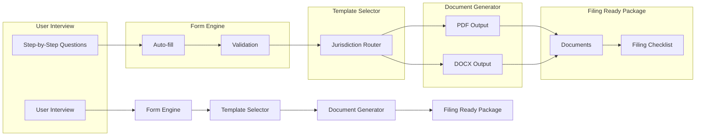

# 📂 Court Document Automation Engine

**TurboTax for legal filings.**

[](LICENSE)
[](CONTRIBUTING.md)
[](https://github.com/dougdevitre/court-doc-engine/pulls)

---

## The Problem

Filing court documents is confusing, expensive, and error-prone. Self-represented litigants face dozens of jurisdiction-specific forms, each with different requirements, formatting rules, and filing procedures. One mistake can mean a rejected filing, a missed deadline, or a lost case.

Attorneys spend hours on document preparation that could be automated. Court clerks spend hours rejecting improperly formatted filings that could have been caught earlier.

## The Solution

A guided, step-by-step document automation engine. Think TurboTax, but for legal filings. Answer simple questions in plain language. The engine selects the right forms for your jurisdiction, auto-fills from case data, validates for completeness, and generates filing-ready PDF and DOCX documents.

No legal expertise required to use it. No expensive software required to run it.

---

## Architecture



---

## Who This Helps

| Audience | How This Helps |
|---|---|
| **Self-represented litigants** | File court documents without an attorney |
| **Legal aid attorneys** | Automate repetitive document preparation |
| **Court clerks** | Receive properly formatted, complete filings |
| **Paralegal staff** | Accelerate document workflows |

---

## Features

- [ ] Guided interview workflows — plain-language questions, step by step
- [ ] Smart auto-fill from case data and prior filings
- [ ] 50-state jurisdiction template library
- [ ] PDF and DOCX generation with court-compliant formatting
- [ ] Filing checklist generator — what to file, where, and when
- [ ] Form validation with clear error messages
- [ ] Save and resume incomplete interviews
- [ ] Template contribution system for community-maintained forms

---

## Tech Stack

| Layer | Technology |
|---|---|
| Language | TypeScript |
| Runtime | Node.js |
| PDF | pdf-lib / Puppeteer |
| DOCX | docx.js |
| Testing | Vitest |
| Linting | ESLint + Prettier |

---

## Quick Start

```bash
git clone https://github.com/dougdevitre/court-doc-engine.git
cd court-doc-engine
npm install
npm run dev
```

---

## Justice OS Ecosystem

| Repo | Description |
|---|---|
| [justice-os](https://github.com/dougdevitre/justice-os) | Core modular platform |
| [mobile-court-access](https://github.com/dougdevitre/mobile-court-access) | Mobile-first court access kit |
| [vetted-legal-ai](https://github.com/dougdevitre/vetted-legal-ai) | RAG engine with citation validation |
| [court-doc-engine](https://github.com/dougdevitre/court-doc-engine) | Document automation for legal filings (you are here) |

---

## Contributing

See [CONTRIBUTING.md](CONTRIBUTING.md) for guidelines.

## License

MIT — see [LICENSE](LICENSE).
