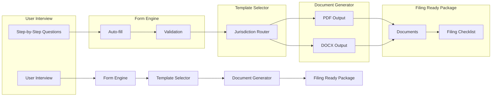

# 📂 Court Document Automation Engine

**TurboTax for legal filings.**

[](LICENSE)

[](CONTRIBUTING.md)
[](https://github.com/dougdevitre/court-doc-engine/pulls)

---

## The Problem

Filing court documents is confusing, expensive, and error-prone. Self-represented litigants face dozens of jurisdiction-specific forms, each with different requirements, formatting rules, and filing procedures. One mistake can mean a rejected filing, a missed deadline, or a lost case.

Attorneys spend hours on document preparation that could be automated. Court clerks spend hours rejecting improperly formatted filings that could have been caught earlier.

## The Solution

A guided, step-by-step document automation engine. Think TurboTax, but for legal filings. Answer simple questions in plain language. The engine selects the right forms for your jurisdiction, auto-fills from case data, validates for completeness, and generates filing-ready PDF and DOCX documents.

No legal expertise required to use it. No expensive software required to run it.

---

## Architecture



---

## Who This Helps

| Audience | How This Helps |
|---|---|
| **Self-represented litigants** | File court documents without an attorney |
| **Legal aid attorneys** | Automate repetitive document preparation |
| **Court clerks** | Receive properly formatted, complete filings |
| **Paralegal staff** | Accelerate document workflows |

---

## Features

- [ ] Guided interview workflows — plain-language questions, step by step
- [ ] Smart auto-fill from case data and prior filings
- [ ] 50-state jurisdiction template library
- [ ] PDF and DOCX generation with court-compliant formatting
- [ ] Filing checklist generator — what to file, where, and when
- [ ] Form validation with clear error messages
- [ ] Save and resume incomplete interviews
- [ ] Template contribution system for community-maintained forms

---

## Tech Stack

| Layer | Technology |
|---|---|
| Language | TypeScript |
| Runtime | Node.js |
| PDF | pdf-lib / Puppeteer |
| DOCX | docx.js |
| Testing | Vitest |
| Linting | ESLint + Prettier |

---

## Quick Start

```bash
git clone https://github.com/dougdevitre/court-doc-engine.git
cd court-doc-engine
npm install
npm run dev
```

### Generate a Court Document Programmatically

```typescript
import { InterviewEngine } from './src/interview/engine';

const engine = new InterviewEngine();

// Start a guided interview for a Missouri eviction petition
const session = await engine.startInterview('eviction-petition', { jurisdiction: 'MO' });

// Answer questions step by step
await session.answer('plaintiff_name', 'Jane Smith');
await session.answer('defendant_name', 'John Doe');
await session.answer('property_address', '123 Main St, Springfield, MO 65801');
await session.answer('grounds', 'nonpayment');
await session.answer('amount_owed', 2400);

// Generate filing-ready documents
const filingPackage = await session.generate({ formats: ['pdf', 'docx'] });

console.log(`Generated ${filingPackage.documents.length} document(s)`);
console.log(`Filing checklist: ${filingPackage.checklist.length} steps`);
```

> See [examples/generate-petition.ts](examples/generate-petition.ts) for a complete working example.

---

## Roadmap

| Feature | Status |
|---------|--------|
| Guided interview engine with branching logic | In Progress |
| Missouri template library (eviction, small claims) | In Progress |
| PDF generation with court-compliant formatting | Planned |
| DOCX generation via docx.js | Planned |
| Save and resume incomplete interviews | Planned |
| Community template contribution system | Planned |

---

## Justice OS Ecosystem

This repository is part of the **Justice OS** open-source ecosystem — 12 interconnected projects building the infrastructure for accessible justice technology.

| Repository | Description |
|-----------|-------------|
| [justice-os](https://github.com/dougdevitre/justice-os) | Core modular platform — the foundation |
| [mobile-court-access](https://github.com/dougdevitre/mobile-court-access) | Mobile-first court access kit |
| [vetted-legal-ai](https://github.com/dougdevitre/vetted-legal-ai) | RAG engine with citation validation |
| [court-doc-engine](https://github.com/dougdevitre/court-doc-engine) | TurboTax for legal filings |
| [cognitive-load-ui](https://github.com/dougdevitre/cognitive-load-ui) | Design system for stressed users |
| [multilingual-justice](https://github.com/dougdevitre/multilingual-justice) | Real-time legal translation |
| [justice-api-gateway](https://github.com/dougdevitre/justice-api-gateway) | Interoperability layer for courts |
| [justice-analytics](https://github.com/dougdevitre/justice-analytics) | Bias detection and disparity dashboards |
| [evidence-timeline](https://github.com/dougdevitre/evidence-timeline) | Evidence timeline builder |
| [digital-literacy-sim](https://github.com/dougdevitre/digital-literacy-sim) | Digital literacy simulator |
| [pro-se-toolkit](https://github.com/dougdevitre/pro-se-toolkit) | Self-represented litigant tools |
| [justice-components](https://github.com/dougdevitre/justice-components) | Reusable component library |

> Built with purpose. Open by design. Justice for all.

---

## Contributing

See [CONTRIBUTING.md](CONTRIBUTING.md) for guidelines.

## License

MIT — see [LICENSE](LICENSE).
