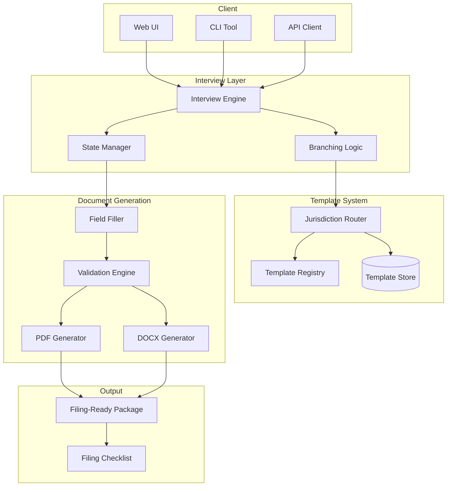
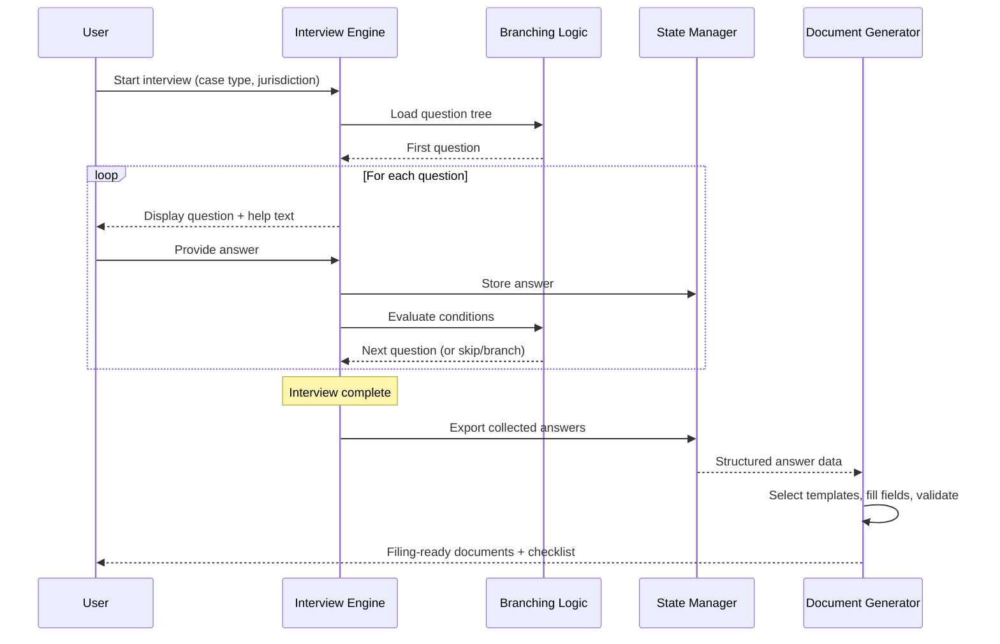
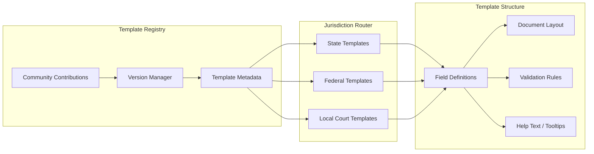
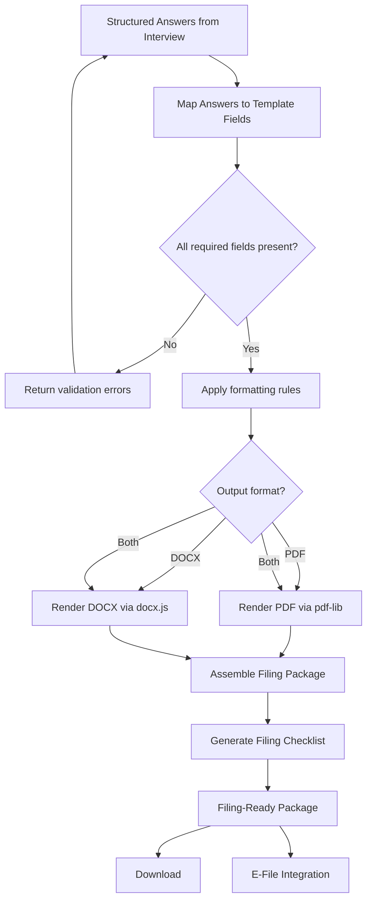

# Architecture — Court Document Automation Engine

## System Overview

```mermaid
graph TD
    subgraph Client
        WEB[Web UI]
        CLI[CLI Tool]
        API_CLIENT[API Client]
    end

    subgraph Interview Layer
        ENGINE[Interview Engine]
        BRANCH[Branching Logic]
        STATE[State Manager]
    end

    subgraph Template System
        REGISTRY[Template Registry]
        SELECTOR[Jurisdiction Router]
        TEMPLATES[(Template Store)]
    end

    subgraph Document Generation
        FILLER[Field Filler]
        VALIDATOR[Validation Engine]
        PDF_GEN[PDF Generator]
        DOCX_GEN[DOCX Generator]
    end

    subgraph Output
        PACKAGE[Filing-Ready Package]
        CHECKLIST[Filing Checklist]
    end

    WEB --> ENGINE
    CLI --> ENGINE
    API_CLIENT --> ENGINE
    ENGINE --> BRANCH
    ENGINE --> STATE
    BRANCH --> SELECTOR
    SELECTOR --> TEMPLATES
    SELECTOR --> REGISTRY
    STATE --> FILLER
    FILLER --> VALIDATOR
    VALIDATOR --> PDF_GEN
    VALIDATOR --> DOCX_GEN
    PDF_GEN --> PACKAGE
    DOCX_GEN --> PACKAGE
    PACKAGE --> CHECKLIST
```

## Interview Flow

```mermaid
sequenceDiagram
    participant User
    participant Engine as Interview Engine
    participant Branch as Branching Logic
    participant State as State Manager
    participant Gen as Document Generator

    User->>Engine: Start interview (case type, jurisdiction)
    Engine->>Branch: Load question tree
    Branch-->>Engine: First question

    loop For each question
        Engine-->>User: Display question + help text
        User->>Engine: Provide answer
        Engine->>State: Store answer
        Engine->>Branch: Evaluate conditions
        Branch-->>Engine: Next question (or skip/branch)
    end

    Note over Engine: Interview complete

    Engine->>State: Export collected answers
    State-->>Gen: Structured answer data
    Gen->>Gen: Select templates, fill fields, validate
    Gen-->>User: Filing-ready documents + checklist
```

## Template System

```mermaid
graph LR
    subgraph Registry["Template Registry"]
        META[Template Metadata]
        VERS[Version Manager]
        CONTRIB[Community Contributions]
    end

    subgraph Router["Jurisdiction Router"]
        JR_STATE[State Templates]
        JR_FED[Federal Templates]
        JR_LOCAL[Local Court Templates]
    end

    subgraph Template["Template Structure"]
        FIELDS[Field Definitions]
        LAYOUT[Document Layout]
        RULES[Validation Rules]
        HELP[Help Text / Tooltips]
    end

    META --> JR_STATE
    META --> JR_FED
    META --> JR_LOCAL
    VERS --> META
    CONTRIB --> VERS

    JR_STATE --> FIELDS
    JR_FED --> FIELDS
    JR_LOCAL --> FIELDS
    FIELDS --> LAYOUT
    FIELDS --> RULES
    FIELDS --> HELP
```

## Document Generation Pipeline

```mermaid
flowchart TD
    INPUT[Structured Answers from Interview]
    INPUT --> MAP[Map Answers to Template Fields]
    MAP --> VALIDATE{All required fields present?}

    VALIDATE -->|No| ERRORS[Return validation errors]
    ERRORS --> INPUT

    VALIDATE -->|Yes| FORMAT[Apply formatting rules]
    FORMAT --> SPLIT{Output format?}

    SPLIT -->|PDF| PDF_RENDER[Render PDF via pdf-lib]
    SPLIT -->|DOCX| DOCX_RENDER[Render DOCX via docx.js]
    SPLIT -->|Both| PDF_RENDER
    SPLIT -->|Both| DOCX_RENDER

    PDF_RENDER --> ASSEMBLE[Assemble Filing Package]
    DOCX_RENDER --> ASSEMBLE

    ASSEMBLE --> CHECKLIST[Generate Filing Checklist]
    CHECKLIST --> OUTPUT[Filing-Ready Package]

    OUTPUT --> DOWNLOAD[Download]
    OUTPUT --> EFILE[E-File Integration]
```
